This page provides guidance for end users of the _Invest or Defend_ client; that is, players. For developer guidance, see the [Developer Guide](developer-guide). For end users of the game server (i.e., game admins), see the server-side [End User Guide](https://delta.lancs.ac.uk/secure-digitalisation/invest-or-defend/server/wikis/end-user-guide).

# Introduction

The _Invest or Defend_ client allows user to create accounts and games, as well as to join and play them.

# Creating a New Game

Click ‘Create New Game’:

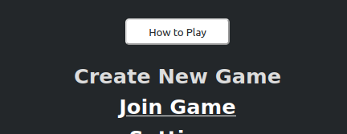

Set up your organisation:

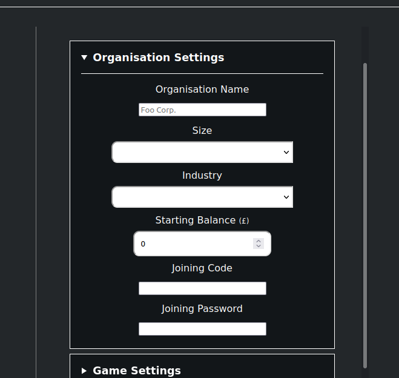

Tweak any game settings:

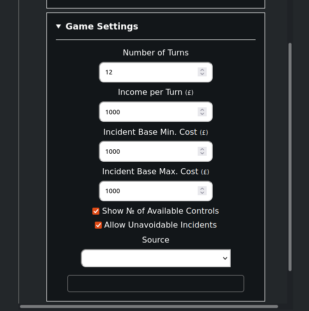

If you select the ‘Competitive Multiplayer’ game type, you can then add additional organisations:

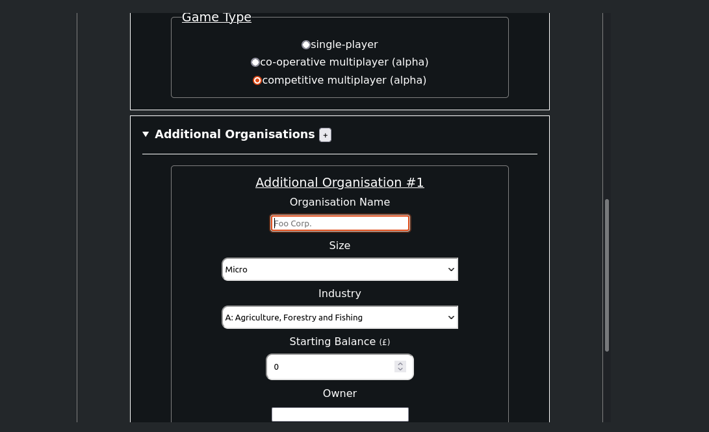

# Playing the Game

At any point in the game, you can review a tutorial for the current stage by clicking the button in the top-left:

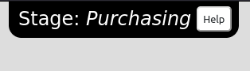

Open the sidebar and click ‘Add Controls’:

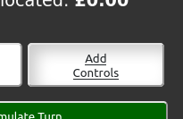

Select the control(s) you want to implement (at this stage, your choices are not committed and you can still remove the controls):

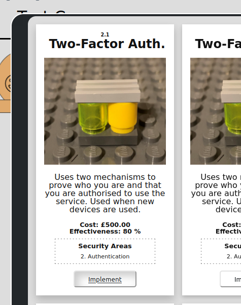

When you are ready, click ‘Simulate Turn’:

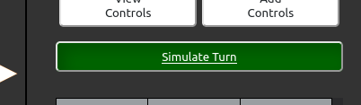

Select a control:

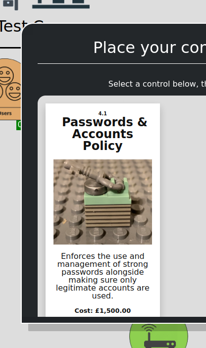

Select the asset on which to place the control:

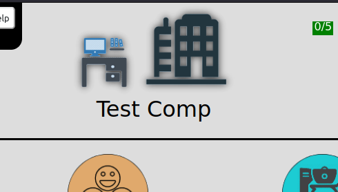
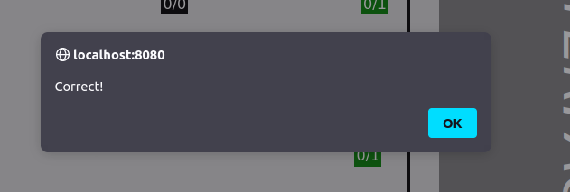

Repeat until all controls are successfully placed. Review the results of the turn:

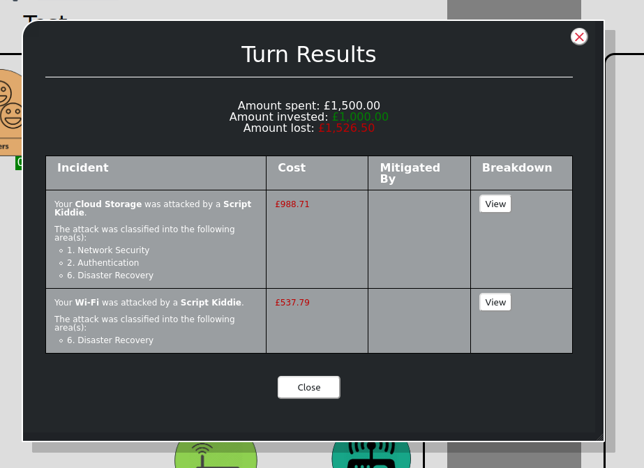

# Playing a Multiplayer Game

**Note: both types of multiplayer game are in early alpha stage**

## Co-operative Multiplayer

Play the game as normal. Clicking on the control ‘Implement’ and ‘Remove’ buttons and the ‘Simulate Turn’ button will register a vote to click, and the buttons will only be clicked when the number of votes passes the threshold.

## Competitive Multiplayer

Play the game as normal. All players must click the ‘Simulate Turn’ button to move the game on:

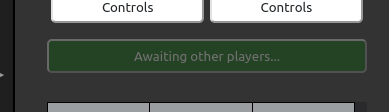