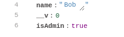
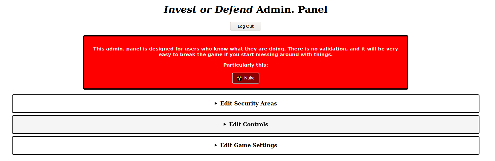
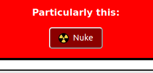
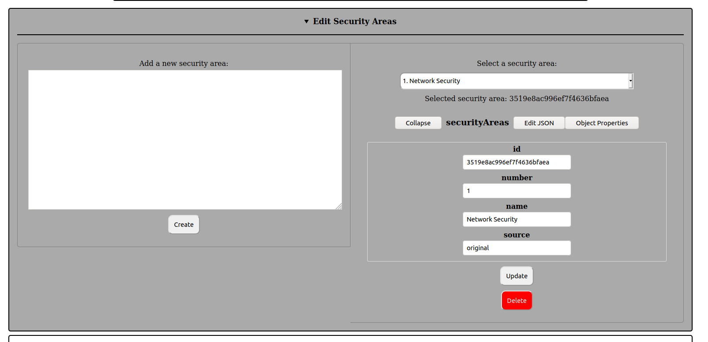
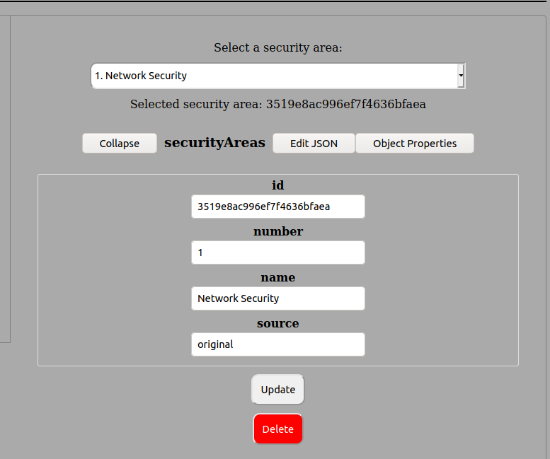
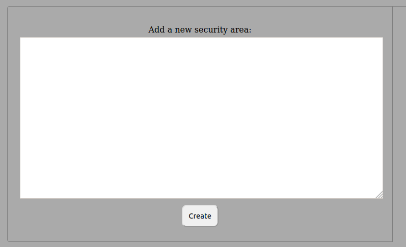
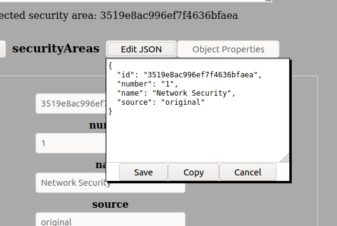
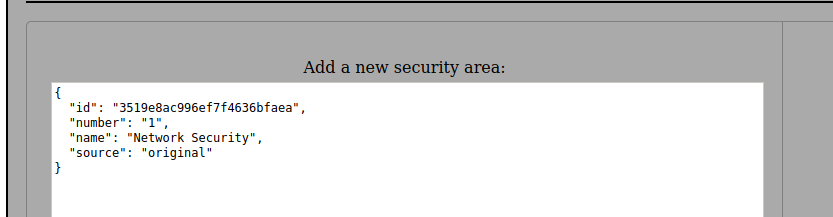
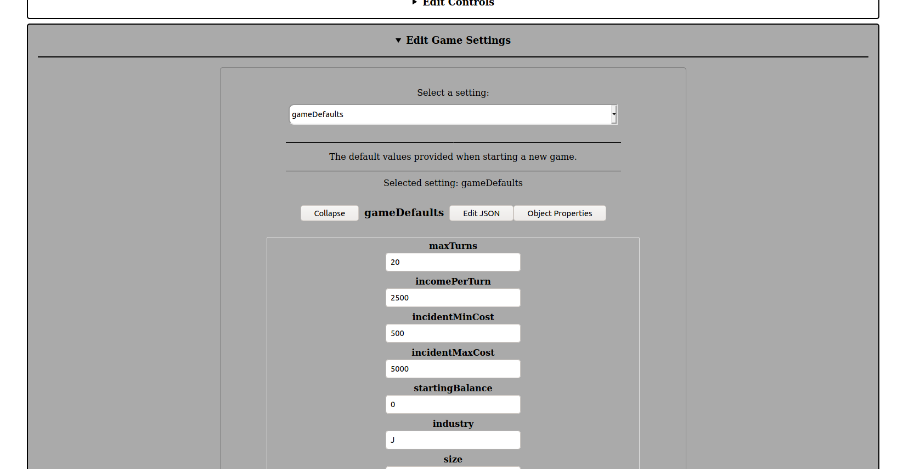

This page provides guidance for end users of the *Invest or Defend* server; that is, game admins. For developer guidance, see the [Developer Guide](developer-guide). For end users of the game itself (i.e., game players), see the client-side End User Guide.

# Introduction

The *Invest or Defend* server provides an Web portal for admin. users to alter game settings. This guide will explain how to perform various tasks using this portal.

# Creating a New Admin. User

There is no front-end for creating a new admin. user; the process must be done manually:

1.  Create a regular user through the client application; then
1.  access the `users` collection in the MongoDB database; and
1.  add a field called `isAdmin` with a value of `true` to the user document:
  

# Accessing the Admin. Portal

Whilst the server is running, go to `https://⟨ server ⟩/admin` and log in to access the admin. portal:

# Become Death, Destroyer of Worlds

Click the ‘Nuke’ button to delete all user-generated documents from the database (with the exception of the users themselves). This means games, events, refresh tokens, etc. After you click this, only users, settings, security areas and controls will remain.

# Editing Security Areas and Controls

Click on either bar to open the customisable drop-down:

You can select an existing security area/control on the right to edit or delete:

You can also create an entirely new security area/control by writing the JSON into the box to the left:

The easiest way to do this is probably to view the JSON of an existing security area/control:

Then copy-paste the JSON to the box on the left and make your edits. **Make sure to remove the `id` property, or you will get an error due to the clash. If you do not declare an `id` value, one will be automatically generated for you when you save the new security area/control:

# Editing Game Settings

Most game parameters are customisable by end users when they create their games, but you may wish to alter the defaults that are selected if they do not do so. There are also game settings that you can edit that define the assets an organisation might have, the types of threat actors that may be encountered, etc.

To edit these, click on the bar to open the drop-down:

Select your setting at the top. If one is defined, a helpful description will be displayed which explains what the setting does. You can then edit the values as you see fit.

**WARNING: THERE IS CURRENTLY NO VALIDATION ON ANY OF THESE SETTINGS VALUES. YOU MIGHT BREAK SOMETHING IF YOU ARE NOT CAREFUL; I RECOMMEND COPYING THE ORIGINAL VALUES SOMEWHERE BEFORE YOU START PLAYING WITH THEM.**